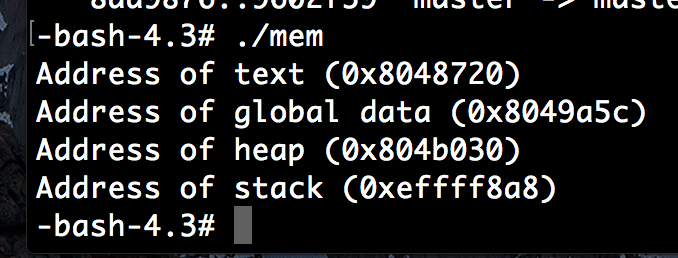

# Project 3 Questions
---
- Brandon Tarney
- 4/9/2017

## 1.A. Explain how these addresses demonstrate the use of virtual addresses in Minix...

We can see from the addresses printed by running "mem"  they appear to be contiguous with the text data followed by global data data followed by heap data and then stack data at the other end of the process memory allocation growing towards the heap. We know that the actual memory used is unlikely to be contiguous, which shows us the power of Virtual memory: making parts of memory which are not actually close appear-so. In fact, if we run this program concurrently or multiple times, we notice the memory locations printed are always the same! Surely we are printing the place in virtual memory, not physical memory.

## 1.B. Does Minix 3.3.0 support a persistent storage "swap area" on disk that allows Minix to either run a process that requires more than the amount of available physica memory, or to run more processes than can fit into memory? Explain your answer by creating a process or set of processes that use more than the available physical memory.

No, Minix does not support swap areas. This can be seen by running my "swap" program (Memory/swap) which attempts to progressively allocate more and more memory, starting at 10 MB and finishing at 1GB, all of which would feasibly be possible given my VM has 1GB of memory and 12GB of disk space (and malloc can allocate up to 4GB of memory on a 32-bit system given the limitations of the parameter size_t). We see that malloc fails between 100MB & 1024MB or 1GB of data. Clearly, if swap space (i.e. disk space) was available, malloc would not fail here.

## 1.C. Show where in the Minix source where the virtual memory mapping is performed, and explain.

It is performed in /usr/src/minix/servers/vm/. Specifically pagetable.c handles the page table which maps virtual memory to physical memory. There are methods like "findhole()" which finds holes as described as physical memory not yet allocated which is available. "vm_allocpage" allocates a page for use by the VM. "pt_writemap() actually creates a page table or adds to an existing one. Even "init()"" does a lot of mapping virtual memory to physical memory.
